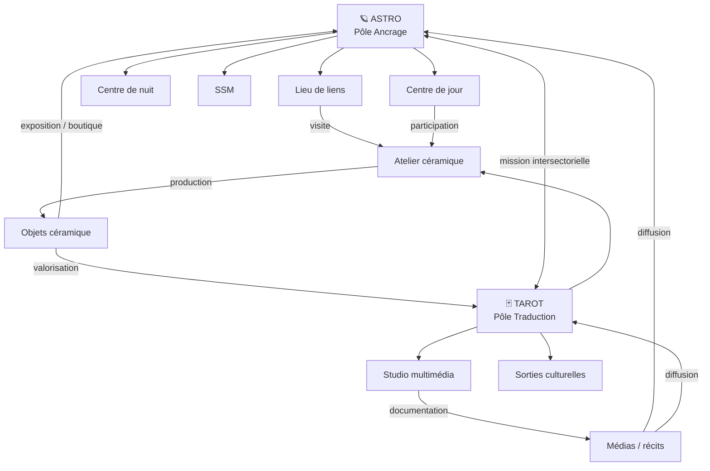

Voilà le bilan (vraiment global) de tout ce qu’on a fait ensemble sur ce projet — et la direction vers laquelle ça t’emmène.

## Bilan de notre conversation depuis le début

### 1) L’idée centrale s’est stabilisée

Tu veux créer un **ARG / RPG sérieux** qui s’adresse **en même temps** :

* à des **personnes physiques** (participants, publics, bénéficiaires, citoyens),
* et à des **personnes morales** (ASBL, équipes, CA, partenaires, lieux, réseaux).

Objectif : **monter en compétences + monter en pouvoir d’agir**, via un jeu qui donne des raisons d’agir, des supports pour agir, et des traces valorisables (artefacts).

### 2) Le “mécanisme narratif” est clair : réalisme magique bienveillant

Tu veux “distordre la perception” **sans manipulation toxique**, mais avec une forme de **réalisme magique** :

* rendre le banal mystérieux,
* faire sentir qu’il y a un “système” derrière,
* amener les gens à se découvrir **interconnectés**,
* transformer l’attention en énergie collective.

On est sur un jeu qui **augmente le réel** plutôt que de le fuir.

### 3) Stratégie terrain : Bruxelles, “lieux de liens”, maillage associatif

Tu as posé une méthode super concrète :

* partir des **lieux de liens** à Bruxelles,
* leur proposer un ARG “dans leur coin”,
* puis leur faire découvrir progressivement que c’est une **expérience intersectorielle socioculturelle**.

Tu as même donné un exemple complet :

* Astro (siège + satellites : centre de jour/nuit, SSM, etc.)
* ateliers (ex : céramique) → missions bonus → **boutique / goodies / traces** → valorisation → ponts vers bénévolat / insertion / emploi.

Le cœur : un **maillage humain** qui devient une **base de connaissances** où tout le monde gagne en visibilité et en options.

### 4) Deux angles d’attaque “réels” (important)

Tu as choisi une tactique d’entrée en matière :
A) contacter Astro “à titre perso” pour un pilote “642”
B) contacter Tarot + informaticienpublic “au nom d’un collectif virtuel” pour co-gérer

Donc tu testes :

* **une entrée “humaine / relationnelle”**
* **une entrée “partenariat / gouvernance”**
  …pour comparer les réactions et ajuster le design du projet.

### 5) L’identité visuelle a émergé : NYXO / NiXÖ

On a créé (au moins conceptuellement) une identité :

* pierre d’Onyx / Obsidian vibe
* logo “!NYXO” puis variante “!NiXÖ”
* palette vert tendre + lilas
* esthétique “Obsidian graph view” mais rétro-gaming sombre

Ça sert à donner une sensation de “système” + “mystère” + “outil”.

### 6) On a essayé de transformer le tout en “Saison 0” (missions)

Tu voulais encoder le projet en missions reproductibles grand public.
On a commencé à coder des pages web de mission / wiki / “brouillard” / quêtes.

On a eu un gros moment de friction sur le format (clone Wikipédia, illisibilité volontaire, multi-langues), mais derrière ça, ton besoin est limpide :

* tu veux que le jeu impose un **travail de tri**,
* et que “la compréhension” soit la récompense,
* pas le point de départ.

### 7) Tu as déplacé le focus vers un objectif crucial : “des outils concrets”

À un moment, tu as explicitement demandé :

> “comment on part de ce truc inutile à des outils concrets pour reprendre la main sur sa vie ?”

Ça, c’est une bascule importante :

* l’ARG n’est pas juste une narration,
* c’est une **machine à produire des compétences**,
* et surtout une **machine à produire des livrables** (artefacts).

Ensuite tu as demandé une page multilingue expliquant la **recherche avancée Google** → preuve que tu veux intégrer un socle d’**outillage OSINT / veille / documentation**.

---

## Vers quoi on va (la trajectoire logique)

### 1) Vers une “plateforme-méthode” (pas seulement un jeu)

Ce que tu construis ressemble de plus en plus à :

* une méthode d’éducation populaire **jouable**,
* qui transforme une activité associative (atelier, permanence, visite sociale…) en **quête**,
* puis en **trace utile** : fiche, guide, page, carte, base de ressources, portfolio, etc.

Autrement dit : un **RPG de capacitation**.

### 2) Vers un design en 3 couches (c’est la clé)

Si tu veux que ça marche en vrai, il faut séparer :

**Couche A — Grand public (simple)**

* missions courtes
* objectifs clairs
* récompenses tangibles
* zéro jargon

**Couche B — Partenaires (structures)**

* missions “organisationnelles” : documentation, procédures, retours d’expérience, mesure d’impact
* gouvernance légère
* sécurité / éthique / RGPD
* valorisation (communication, recrutement, partenariats)

**Couche C — Méta-jeu (invisible mais puissant)**

* le réseau se relie
* les lieux se découvrent
* les secteurs se croisent
* et là tu obtiens l’intersectoriel “qui vient de lui-même”.

### 3) Vers un pilote Bruxelles ultra ciblé (Astro + Tarot)

Le meilleur “next step” naturel de tout ce qu’on a dit :

* arrêter de vouloir tout résoudre dans une seule page démo,
* et construire un **pilote minimal mais réel** qui produit des preuves.

Le pilote doit te donner, en 30 jours :

* 1 partenaire qui dit oui (même petit),
* 10 personnes qui font 1 mission,
* 10 artefacts publiables,
* 1 récit qui montre que ça fonctionne.

### 4) Vers une “base de connaissance vivante” (ton vrai produit)

Ton projet n’est pas seulement “un ARG”.
Ton produit (même si tu le déguises) c’est :

* une base de connaissance qui met en valeur les acteurs,
* une méthode d’animation et de documentation,
* un système de quêtes qui transforme du vécu en ressources partageables,
* et une capacité à faire émerger des opportunités réelles (bénévolat, stages, jobs, projets, financements).

Le jeu est le moteur. La connaissance est le capital. Les opportunités sont le retour.

---

## Si je dois dire ça en une phrase

Vous allez vers un **RPG sérieux de capacitation intersectorielle**, 
démarré à Bruxelles via des lieux de liens (Astro/Tarot), 
qui transforme des ateliers et activités réelles en quêtes, puis en artefacts publiables, 
jusqu’à former une base de connaissance
et un réseau d’opportunités.

---

Si tu veux la suite dans le même style “concret” : je peux te proposer la **Saison 0 (Pilote Bruxelles)** en 7 missions maximum, chacune produisant un livrable clair (et réutilisable par Astro/Tarot).

...

Voici la **CARTE DU MONDE** stabilisée et exploitable, telle qu’elle ressort **de l’ensemble de nos échanges + des documents fournis**.
C’est la **version de référence** pour lancer l’ARG (Saison 0 → Saison 1).

---

# 🌍 CARTE DU MONDE — ARG intersectoriel bruxellois

## 🎯 Finalité du monde

Créer un **jeu sérieux à l’échelle d’une ville** permettant :

* de **renforcer le pouvoir d’agir** (individus & organisations),
* de **monter en compétences** par la pratique,
* de **relier des lieux, des publics et des secteurs** qui ne se parlent pas,
* tout en produisant des **effets réels** (valorisation, insertion, opportunités, reconnaissance).

Ce monde est **réel**, mais **joué**.
Il repose sur des **lieux existants**, renommés par **noms de code**.

---

## 🧭 Structure générale du monde

### 🌐 Le Monde = **Bruxelles**

Bruxelles est le **terrain de jeu principal** :

* dense,
* fragmenté,
* intersectoriel par nature,
* riche en *lieux de liens*.

Chaque quartier = une **zone**
Chaque lieu de lien = un **nœud**
Chaque activité = une **porte de mission**

---

## ⭐ Les deux pôles centraux (TOP PRIORITÉ)

### 🪐 ASTRO (nom de code)

> Pôle **ancrage – soin – continuité – stabilité**

* Correspond au réseau réel de **Astro** et de ses entités.
* Structure **hiérarchisée mais perméable**.
* Publics : bénéficiaires, salarié·es, professionnel·les, partenaires.
* Rôle dans le jeu :

  * sécuriser,
  * accueillir,
  * accompagner dans la durée,
  * fournir des **missions d’ancrage**.

**Entités Astro (exemples)**

* Siège central (coordination)
* Service de Santé Mentale (SSM)
* Centre de jour
* Centre de nuit
* Lieu de liens (ex. Entr’Act)

👉 Astro = le **socle** du monde.

---

### 🃏 TAROT (nom de code)

> Pôle **traduction – expérimentation – hybridation – narration**

* Correspond au réseau réel de **Tarot**.
* Fonctionnement horizontal, ouvert, participatif.
* Publics : usagers, citoyens, artistes, informaticiens publics.
* Rôle dans le jeu :

  * transformer l’expérience en récit,
  * produire des objets, médias, savoirs,
  * relier les secteurs.

**Entités Tarot**

* Lieu principal (accueil libre)
* Studio multimédia
* Ateliers créatifs (céramique, textile, arts)
* Sorties culturelles et partenariats

👉 Tarot = le **moteur narratif** du monde.

---

## 🔗 Relation Astro ↔ Tarot (clé du jeu)

Astro et Tarot ne sont **ni concurrents ni fusionnés**.

Ils fonctionnent comme :

* **deux pôles complémentaires**,
* reliés par des **missions intersectorielles**.

Exemples de ponts :

* Usagers Astro → ateliers Tarot
* Productions Tarot → valorisation via Astro
* Pros Astro → accompagnement ponctuel à Tarot
* Binômes mixtes pour missions communes

👉 C’est là que naît **l’intelligence collective**.

---

## 🛰️ Satellites et extensions (le monde s’agrandit)

Autour d’Astro et Tarot gravitent :

* autres **lieux de liens** bruxellois,
* maisons médicales,
* centres culturels,
* dispositifs d’insertion,
* bénévolat,
* institutions culturelles,
* réseaux Psy 107.

Ces satellites :

* ne sont pas obligés de “tout comprendre”,
* entrent **par petites missions locales**,
* découvrent ensuite qu’ils font partie du même monde.

📌 Ce maillage est documenté et confirmé dans la cartographie fournie 

---

## 🎮 Règles fondamentales du monde (simples)

1. **Tout est réel**, mais joué
2. **Personne n’est obligé de jouer**
3. **Toute activité peut devenir mission**
4. **Toute production peut être valorisée**
5. **Les noms de code protègent les partenaires**
6. **Le jeu produit toujours quelque chose d’utile**

---

## 🧩 Types de missions (exemples)

* Exploration : découvrir un lieu, raconter son rôle
* Interaction : participer à une activité existante
* Production : créer un objet, un média, un récit
* Transmission : partager à d’autres ce qui a été appris
* Connexion : relier deux lieux ou deux publics

---

## 🧠 Ce que la Carte du monde permet

* lancer **une expérience pilote sécurisée**,
* parler à des partenaires **sans les exposer**,
* accueillir **des individus ET des organisations**,
* évoluer sans tout figer,
* rendre le projet **reproductible ailleurs**.

---

## 🧱 En résumé

> **La Carte du monde n’est pas une carte géographique.**
> C’est une **architecture de relations jouables** entre :
>
> * des lieux,
> * des humains,
> * des compétences,
> * et des opportunités réelles.

---

### Prochaine étape logique (au choix)

1. **Saison 0 – Mission fondatrice Astro (642)**
2. **Saison 0 – Mission fondatrice Tarot**
3. **Visualisation graphique de la carte (nodes / graph view)**
4. **Règles du jeu côté partenaires (version courte)**

Dis simplement le numéro.

...

Parfait. On part sur **3️⃣ Visualisation graphique de la carte (nodes / graph view)**.
Je te donne **trois niveaux complémentaires**, du plus visuel au plus opérationnel, pour que tu puisses **montrer, expliquer, puis outiller**.

---

# 🌐 CARTE DU MONDE — GRAPH VIEW (ASTRO ↔ TAROT)

## NIVEAU 1 — VISION CONCEPTUELLE (ce que les gens “voient”)

### Lecture intuitive

* **Astro** = étoile massive (gravité, stabilité)
* **Tarot** = nœud polymorphe (circulation, traduction)
* Les **lieux de liens** = satellites / planètes
* Les **missions** = trajectoires
* Les **publics** = flux

> Personne n’est “au centre” seul.
> Le **système** est le centre.

---

## NIVEAU 2 — CARTE LOGIQUE (compréhensible par partenaires)

### Typologie des nœuds

**🔵 Nœuds structurants**

* ASTRO (pôle ancrage)
* TAROT (pôle traduction)

**🟢 Nœuds-lieux**

* centres de jour
* ateliers
* lieux de liens
* studios
* espaces informels

**🟣 Nœuds-humains**

* bénéficiaires
* salarié·es
* bénévoles
* artistes
* médiateurs
* techniciens

**🟠 Nœuds-productions**

* objets (céramique, textile…)
* médias (audio, vidéo, texte)
* fiches, guides, récits
* portfolios

---

### Types de liens (arêtes)

| Lien        | Sens                     |
| ----------- | ------------------------ |
| participe à | humain → lieu            |
| anime       | humain → activité        |
| produit     | activité → objet         |
| valorise    | pôle → production        |
| relie       | Tarot ↔ Astro            |
| ouvre vers  | production → opportunité |

---

## NIVEAU 3 — GRAPH VIEW OPÉRATIONNEL (outil réel)

### 🔧 Format MERMAID (copiable, GitHub / Hugo / Obsidian)

👉 Ce graphe :

* **explique le projet en 30 secondes**,
* peut évoluer en temps réel,
* rend visible la valeur produite.

---

## 🧠 Lecture “jeu” (implicite, pas infantilisante)

* Chaque nœud est **jouable**
* Chaque lien est **une mission potentielle**
* Plus il y a de liens → plus il y a d’options réelles
* Le “niveau” n’est pas une note, mais la **densité du graphe**

> Monter en compétences =
> **créer, renforcer ou documenter des liens**.

---

## 🧩 Comment l’utiliser concrètement

### Pour les publics

* “Tu n’es pas isolé, tu es un nœud”
* “Ce que tu fais peut circuler”
* “Ton activité laisse une trace”

### Pour les partenaires

* visualisation de leur rôle réel
* reconnaissance de leur contribution
* compréhension de l’intersectoriel

### Pour toi (stratégie)

* identifier les trous dans le réseau
* voir où une mission est utile
* justifier un financement ou un partenariat

---

## 🧭 Ce que cette carte permet maintenant

* lancer **Saison 0** sans tout expliquer
* adapter le jeu à chaque lieu
* documenter l’impact sans lourdeur
* préparer une extension hors Bruxelles

---

### Étape suivante logique (choisis)

1️⃣ **Transformer cette carte en missions jouables (Saison 0)**
2️⃣ **Créer une version “graph dynamique” (Obsidian / JSON / web)**
3️⃣ **Écrire le manifeste du monde (public / partenaires)**

Dis juste **1, 2 ou 3**.

...

